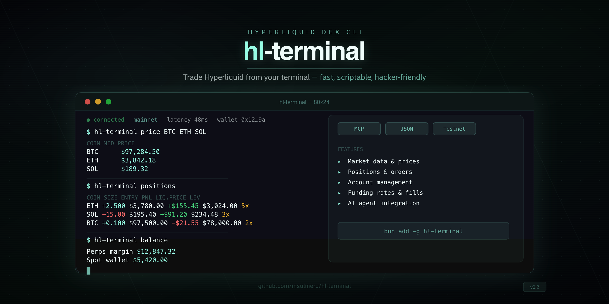

<p align="center">
  
</p>

<p align="center">
  Hyperliquid DEX terminal — read market data, manage accounts, and execute trades from the command line or via AI agent (MCP).
</p>

## Features

- **Market data** — prices, positions, orders, balances, funding rates, fill history
- **Account management** — add, remove, switch accounts with secure local storage
- **Trade execution** -- limit/market orders, cancel, leverage, take-profit, stop-loss
- **Agent-native** — built-in MCP server mode for AI agent integration
- **Machine-readable** — JSON output, LLM manifest, structured error codes
- **Testnet support** — `--testnet` flag for risk-free testing

## Installation

```bash
# bun (recommended)
bun add -g hl-terminal

# npm
npm install -g hl-terminal
```

## Quick Start

```bash
# Add your first account
hl-terminal account add --name main

# Check BTC price
hl-terminal price BTC

# View your positions
hl-terminal positions

# View your balance
hl-terminal balance

# List available markets
hl-terminal markets

# Place a limit buy order
hl-terminal order create BTC buy 0.001 95000

# Place a market sell order
hl-terminal order create ETH sell 1.5

# Set 10x leverage on BTC
hl-terminal position leverage BTC 10
```

## Commands

### Account Management

| Command                              | Description                           |
| ------------------------------------ | ------------------------------------- |
| `hl-terminal account add --name <n>`          | Add account (prompts for private key) |
| `hl-terminal account watch <addr> --name <n>` | Add read-only account (address only)  |
| `hl-terminal account ls`                      | List all accounts                     |
| `hl-terminal account rm <name>`               | Remove an account                     |
| `hl-terminal account switch <name>`           | Switch default account                |

### Market Data

| Command             | Description                                  |
| ------------------- | -------------------------------------------- |
| `hl-terminal price <coin>`   | Current mid-price for a coin                 |
| `hl-terminal balance`        | Perps margin + spot wallet balance           |
| `hl-terminal positions`      | Open positions with PnL, leverage, liq price |
| `hl-terminal orders`         | Open orders with side, size, price, type     |
| `hl-terminal markets`        | Available markets with metadata              |
| `hl-terminal funding [coin]` | Current funding rates or history for a coin  |
| `hl-terminal fills [coin]`   | Trade history with time range and pagination |

### Trade Execution

| Command | Description |
| --- | --- |
| `hl-terminal order create <coin> <side> <size> [price]` | Place limit (with price) or market (without) order |
| `hl-terminal order cancel <oid>` | Cancel an order by ID |
| `hl-terminal order cancel-all` | Cancel all open orders (optional `--coin` filter) |

### Position Management

| Command | Description |
| --- | --- |
| `hl-terminal position leverage <coin> <leverage>` | Set leverage (add `--isolated` for isolated margin) |
| `hl-terminal position tp <coin> --price <price>` | Place take-profit trigger on open position |
| `hl-terminal position sl <coin> --price <price>` | Place stop-loss trigger on open position |

### Global Options

| Option          | Description            |
| --------------- | ---------------------- |
| `--testnet, -t` | Use testnet network    |
| `--json`        | Output as JSON         |
| `--mcp`         | Run as MCP server      |
| `--llms`        | Print command manifest |
| `--help`        | Show help              |
| `--version`     | Show version           |

## MCP Server

hl-terminal works as an [MCP](https://modelcontextprotocol.io) server for AI agents:

```bash
hl-terminal --mcp
```

All commands are exposed as tools that AI agents can call programmatically.

## Security

Private keys are stored locally at `~/.hyperliquid/config.json` with `0600` file permissions. Keys never leave your machine. Read-only watch accounts are available for monitoring without exposing any keys.

See [SECURITY.md](./SECURITY.md) for the full security policy.

## Contributing

See [CONTRIBUTING.md](./CONTRIBUTING.md) for development setup and guidelines.

## License

[MIT](./LICENSE)
